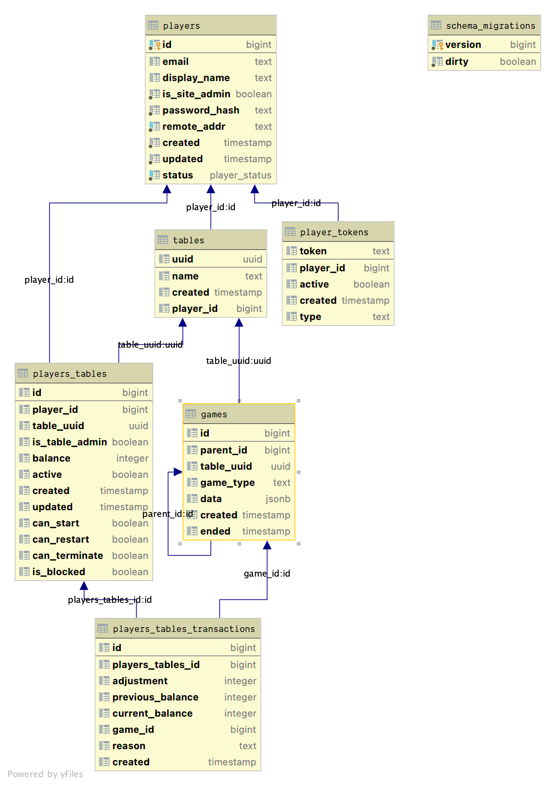

# Monday Night Poker - Architecture

This document describes the architecture of the Monday Night Poker open-source project.

## Services

### Front-end

The front-end is a single-page app built using Vue.js. The source code for the front-end is [github.com/weters/mondaynightpoker-vue](https://github.com/weters/mondaynightpoker-vue).

Most of the communication happens to the back-end via REST. The gameplay itself is handled using websockets.

### Back-end

The back-end is a web API built using Golang. Most of the API is RESTful, but the gameplay communicates using websockets.

### Database

The datastore is a PostgreSQL database. Migrations are handled using [golang-migrate/migrate](https://github.com/golang-migrate/migrate). The migration files are found in the [./sql](./sql) directory. You can manually run the migrations using the following command:
```shell
$ go run ./cmd/migrate
```

If you want to migrate to a specific version, you can use the `-v` flag.
```shell
$ go run ./cmd/migrate -v 5
```

Note: migrations are automatically run when you start the web server

#### Database Design

Table | Description
--- | ---
`players` | Contains all of the players who sign up with Monday Night Poker.
`tables` | A table can be thought of as a single game session.
`players_tables` | Assigns players to a particular table. Balances are kept within this table.
`players_tables_transactions` | A change log for every change made to the `players_tables.balance` column.
`games` | Keeps track of individual games played at a table.
`player_tokens` | Used for use-once style tokens like when verifying an account or resetting a password.



## Deployment

Todo...

## Code Layout

This codebase tries to adhere to the [Standard Go Project Layout](https://github.com/golang-standards/project-layout).

Below are the primary directories within the project

Dir | Description
--- | ---
[cmd](cmd) | Contains command-line applications
[deployments](deployments) | Kubernetes configuration
[internal/config](internal/config) | Contains logic for loading and retrieving configuration
[internal/email](internal/email) | Handles sending emails and rendering email templates
[internal/jwt](internal/jwt) | Handles signing and verifying the JWT
[internal/mux](internal/mux) | Contains the controller logic
[internal/util](internal/util) | Contains some miscellaneous helper functions
[pkg/deck](pkg/deck) | Has the deck and card logic
[pkg/playable](pkg/playable) | Contains all the game logic and rules.
[pkg/room](pkg/room) | Responsibly for managing the live game state.
[pkg/table](pkg/table) | This is essentially the database model. All queries to the PostgreSQL database are written here.
[pkg/token](pkg/token) | A Small package for generate a crypto-secure token.
[sql](sql) | Contains the database migration files
[templates](templates) | Email templates

Todo: go in depth about playable and room

## Future Enhancements

Right now this service cannot be scaled horizontally because of websockets. Game state is kept in-memory. Before we can scale the back-end, we need to ensure that all users are stickied to the server hosting the game.
